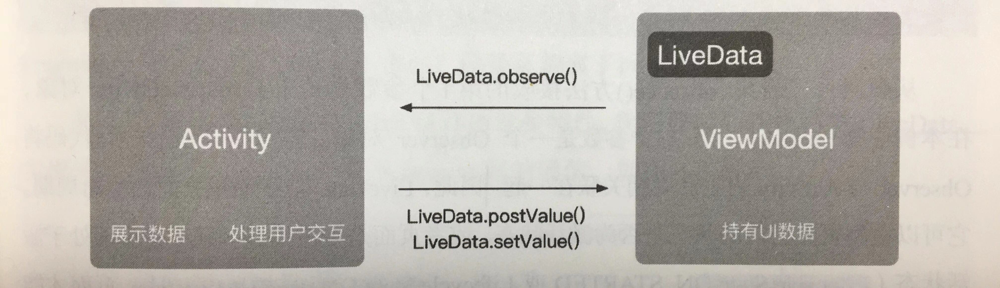

#### ViewModel & LiveData
ViewModel能够将数据从Activity中剥离出来。
ViewModel的主要作用是存放页面所需要的各种数据。

ViewModel用于存放页面的数据，当数据发生变化时，需要通知页面进行更新。ViewModel与页面之间的通信：在没有LiveData之前，用定义接口可以完成这个需求。在有了LiveData之后，可以使用LiveData。

LiveData的本质是观察者模式，并且它能感知页面的生命周期-->只在页面存活时才会进行通知，从而避免内存泄漏。
当然也可以使用observeForever()方法让LiveData忽略页面的生命周期，但用完之后，要记得使用removeObserver()移除监听，否则会造成内存泄漏。

LiveData是一个可被观察的数据容器类。可以理解为数据的容器，它将数据包装起来，使数据成为被观察者，当该数据发生变化时，观察者能够获得通知。我们不需要自己去实现观察者模式，LiveData内部已经默认实现好了，我们只要使用就可以了。
