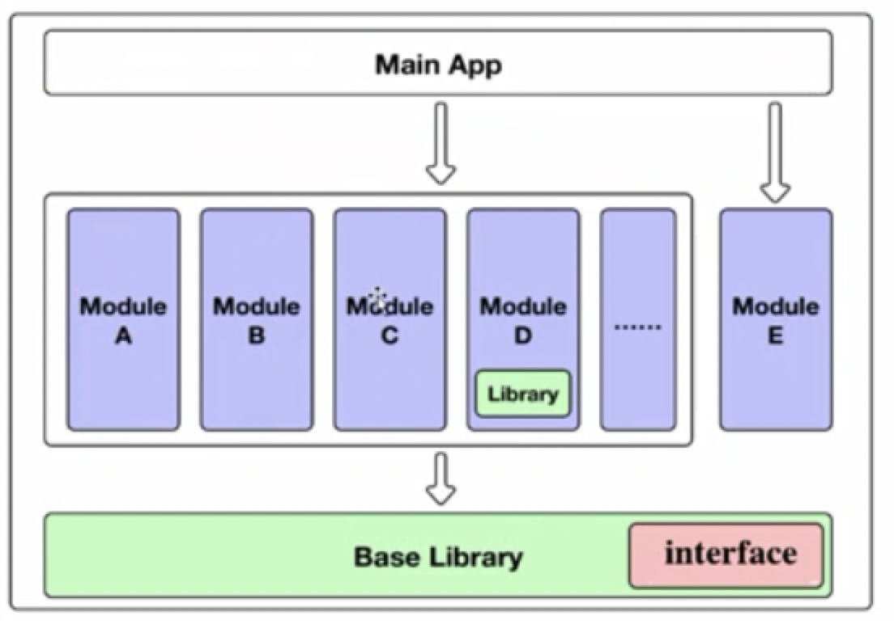

### my pure music app

> https://github.com/KunMinX/Jetpack-MVVM-Best-Practice

#### 1. 折叠悬浮效果

> 具体使用方法：CoordinatorLayout 作为最外层容器，AppBarLayout 作为第一个子 view，还包含一个 NestedScrollView 作为一起滑动的控件，CollapsingToolbarLayout 嵌套在 AppBarLayout 里，AppBarLayout 里面又嵌套 ImageView 和 Toolbar。

> https://blog.csdn.net/smileiam/article/details/61643006

> https://www.jianshu.com/p/eec5a397ce79

```
CoordinatorLayout{
    // 用来实现折叠ActionBar
    AppBarLayout(自带behavior，可省略不写){ // AppBarLayout是个LinearLayout
        // 可以是其它控件，不必非得是这个CollapsingToolbarLayout
        // CollapsingToolbarLayout用来实现折叠布局
        // CollapsingToolbarLayout需要作为AppBarLayout的子View才会有效。
        CollapsingToolbarLayout(设置scrollFlags = [scroll|enterAlwaysCollapsed...]){
            控件1(设置collapseMode = [off|pin|parallax]，折叠效果){
            }

            控件2(设置collapseMode){
            }

            ...
        }

        TabLayout(不设置scrollFlags，就不会折叠){ // 上面的折叠后，只剩TabLayout悬停
        }
    }

    RecyclerView(要设置behavior){
    }
}
```

#### 2. fitsSystemWindows 属性

页面有输入框时都要考虑会不会被键盘挡住，于是 fitsSystemWindows 属性就派上了用场

###### 属性说明
fitsSystemWindows 属性可以让 view 根据系统窗口来调整自己的布局；简单点说就是我们在设置应用布局时是否考虑系统窗口布局，这里系统窗口包括系统状态栏、导航栏、输入法等，包括一些手机系统带有的底部虚拟按键。

android:fitsSystemWindows=”true” （触发 View 的 padding 属性来给系统窗口留出空间）
这个属性可以给任何 view 设置,只要设置了这个属性此 view 的其他所有 padding 属性失效，同时该属性的生效条件是只有在设置了透明状态栏(StatusBar)或者导航栏(NavigationBar)此属性才会生效。

注意 ⚠️： fitsSystemWindows 只作用在 Android4.4 及以上的系统，因为 4.4 以下的系统 StatusBar 没有透明状态。

###### 应用场景
在不同 Android 版本下，App 状态栏和不同版本中系统本身的状态栏的适配；
兼容带有底部虚拟按键的手机系统。

摘抄自 https://www.cnblogs.com/xgjblog/p/9517645.html

注：该属性的生效条件是只有在设置了透明状态栏(StatusBar)或者导航栏(NavigationBar)此属性才会生效。
原 pure music APP 中是用工具类通过代码设置了透明状态栏才生效的，没有通过 theme style设置。

---

### 组件化

https://study.163.com/course/courseLearn.htm?courseId=1209450865#/learn/live?lessonId=1279546795&courseId=1209450865



做了哪些工作
组件化核心:
1、APP和lib之间的切换
2、gradle
3、通信

```
project
├── main
├── module_base
├── module_kotlin
└── module_test
```
实现了组件化，但是有些疑问不太确定
1. 不太清楚module的xxApplication的initialize()实现，以及各module的清单文件里要不要加上xxApplication。

貌似是这样：当为子module时，在main的xxApplication里，联动初始化各个子module的xxApplication的initialize()；
当各子module设置为可独立运行时，才在清单文件里加上name=xxApplication。

2. 对于他们的通信，是通过在module_base里的接口来实现的。

---

### 学习感悟

1. 研究一下 pure music，遇到不会的就查查百度
